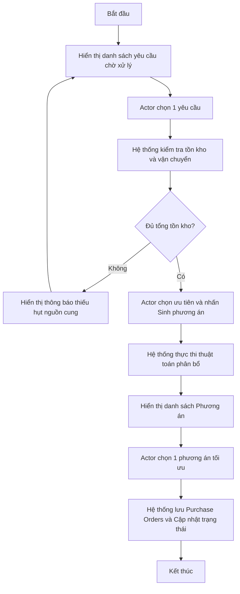
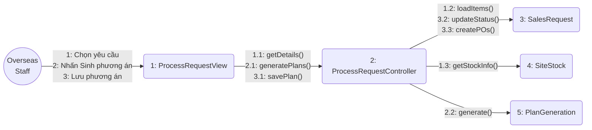
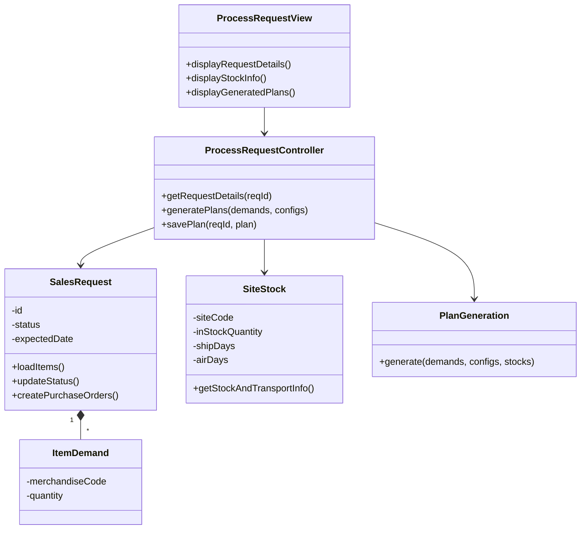
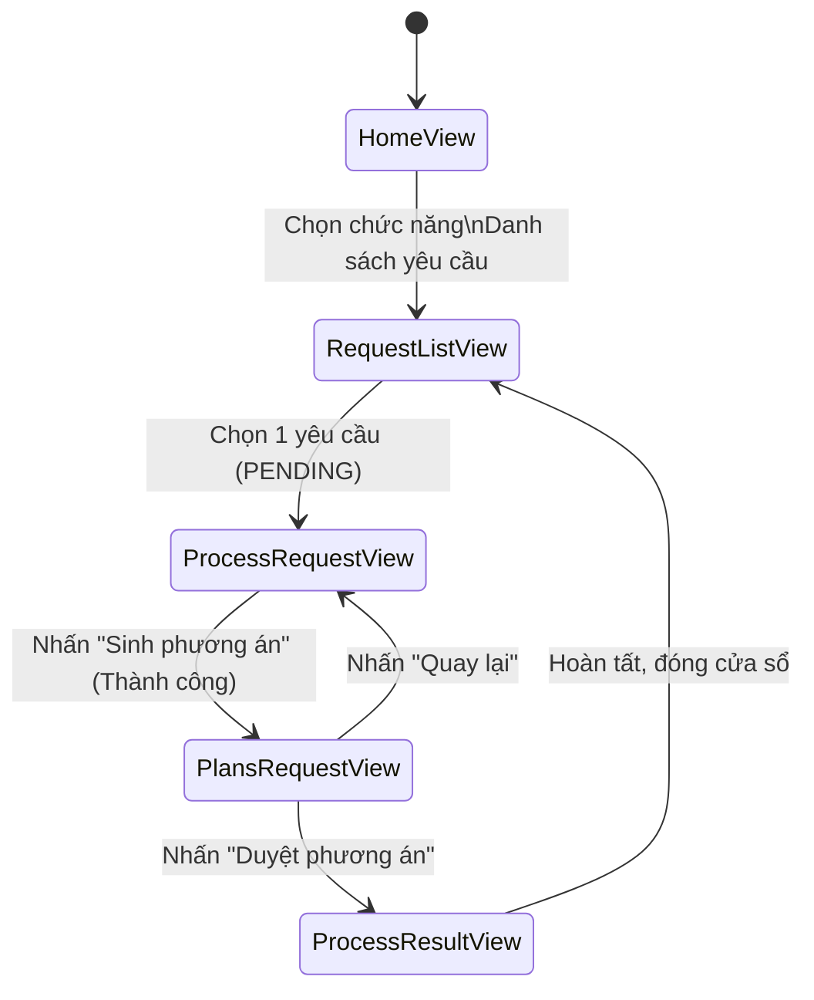
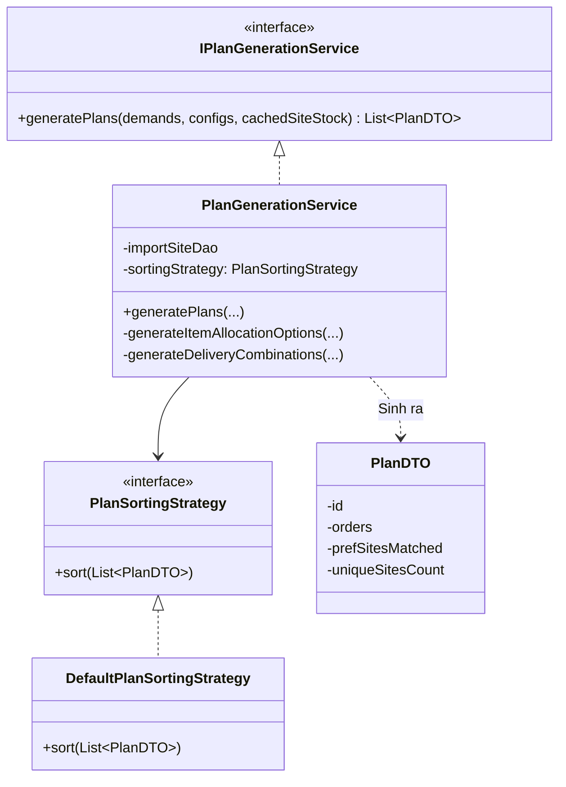
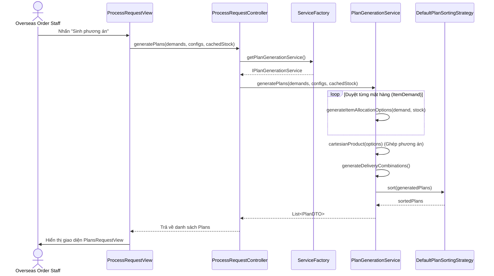
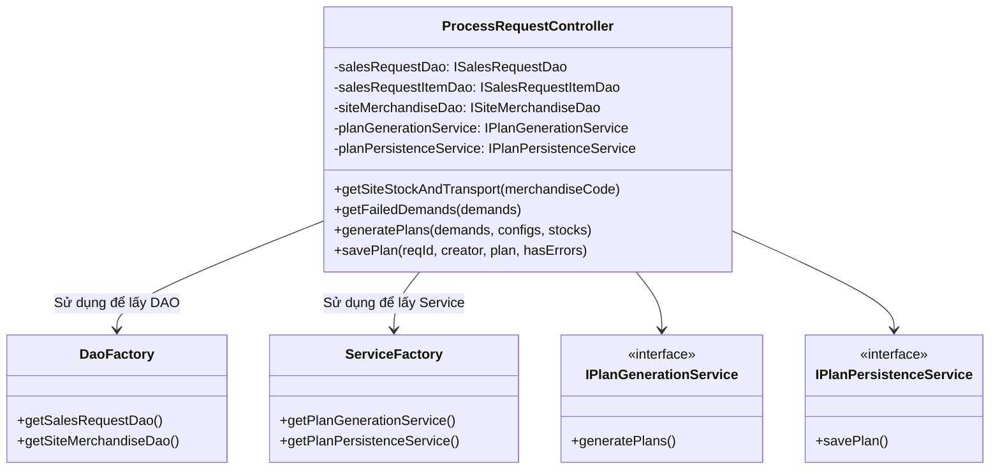

# Giải bài tập 2 đến 6 - Use case: Xử lý yêu cầu nhập hàng

## Bài tập 2: Đặc tả Usecase & Biểu đồ hoạt động

### 1. Đặc tả Usecase
- **Tên Use case**: Xử lý yêu cầu nhập hàng
- **Actor chính**: Nhân viên mua hàng nước ngoài (Overseas Order Staff)
- **Mục đích**: Dựa trên các yêu cầu từ phòng Sales, tính toán lượng tồn kho ở các kho đối tác (Site) để sinh ra phương án phân bổ đơn hàng nhập khẩu tối ưu.
- **Tiền điều kiện**: Actor đã đăng nhập hệ thống với quyền Overseas. Tồn tại ít nhất 1 yêu cầu nhập hàng ở trạng thái `PENDING`.
- **Luồng sự kiện chính (Basic Flow)**:
  1. Actor chọn chức năng "Danh sách yêu cầu chờ xử lý".
  2. Hệ thống hiển thị danh sách các yêu cầu nhập hàng (`PENDING`).
  3. Actor chọn một yêu cầu cụ thể và nhấn "Xử lý".
  4. Hệ thống tải dữ liệu chi tiết các mặt hàng yêu cầu, truy vấn tồn kho hiện hành tại các Site và thông tin thời gian vận chuyển (tàu/máy bay).
  5. Actor cấu hình các thông số ưu tiên (Site mong muốn, phương thức vận chuyển mong muốn) và nhấn "Sinh phương án".
  6. Hệ thống tự động tính toán, gom nhóm tồn kho và sinh ra các phương án mua hàng (Plans) khả thi.
  7. Hệ thống hiển thị danh sách các phương án để Actor đối chiếu.
  8. Actor chọn một phương án và nhấn "Lưu phương án".
  9. Hệ thống cập nhật trạng thái yêu cầu thành `PROCESSED` và tự động tạo ra các Đơn hàng mua (Purchase Orders) nháp.

- **Luồng thay thế/Ngoại lệ (Alternative Flow)**:
  - **Ngoại lệ ở bước 6**: Nếu tổng tồn kho của tất cả các Site không đủ để đáp ứng nhu cầu cho bất kỳ một mặt hàng nào trong yêu cầu, hệ thống sẽ báo lỗi "Không đủ nguồn cung", và ngừng việc sinh phương án.

### 2. Biểu đồ hoạt động (Activity Diagram - Luồng chính)



---

## Bài tập 3: Biểu đồ mức phân tích

### 1. Biểu đồ trình tự mức phân tích (Analysis Sequence Diagram)
*Scenario: Luồng thành công (Sinh và duyệt phương án)*

```mermaid
sequenceDiagram
    actor OOS as Overseas Order Staff
    boundary View as :ProcessRequestView
    control Controller as :ProcessRequestController
    entity Req as :SalesRequest
    entity Site as :SiteStock
    entity Plan as :PlanGeneration

    OOS->>View: Chọn yêu cầu & Nhấn Xử lý
    View->>Controller: getRequestDetails(reqId)
    Controller->>Req: loadItems()
    Controller->>Site: getStockAndTransportInfo()
    Site-->>Controller: Dữ liệu tồn kho
    Controller-->>View: Hiển thị chi tiết yêu cầu & tồn kho
    OOS->>View: Cấu hình ưu tiên & Nhấn Sinh phương án
    View->>Controller: generatePlans(demands, configs)
    Controller->>Plan: generate(demands, configs, stocks)
    Plan-->>Controller: Danh sách PlanDTO
    Controller-->>View: Hiển thị danh sách kế hoạch
    OOS->>View: Chọn 1 kế hoạch & Nhấn Lưu
    View->>Controller: savePlan(reqId, plan)
    Controller->>Req: updateStatus(PROCESSED)
    Controller->>Req: createPurchaseOrders(plan)
    Controller-->>View: Thông báo thành công
```

### 2. Biểu đồ giao tiếp (Communication Diagram)
*Tương đương với Scenario sinh phương án ở trên*



### 3. Biểu đồ lớp phân tích (Analysis Class Diagram)



---

## Bài tập 4: Chuyển đổi màn hình & Subsystem

### 1. Sơ đồ chuyển đổi màn hình (Screen Transition Diagram)



### 2. Đặc tả các màn hình

| Tên màn hình | Mục đích | Các thành phần UI chính | Sự kiện / Hành vi |
| --- | --- | --- | --- |
| **RequestListView** | Hiển thị danh sách các yêu cầu chờ xử lý. | - Bảng danh sách yêu cầu (Mã, Người tạo, Ngày, Trạng thái).<br>- Nút "Xử lý". | Double-click hoặc bấm nút "Xử lý" để chuyển sang `ProcessRequestView`. |
| **ProcessRequestView** | Xem chi tiết yêu cầu, cấu hình ưu tiên. | - Bảng chi tiết mặt hàng (Mã, Tên, Số lượng, Tồn kho hiện tại).<br>- ComboBox chọn Site ưu tiên.<br>- ComboBox chọn Vận chuyển ưu tiên.<br>- Nút "Sinh phương án". | Nhấn "Sinh phương án" để gọi controller sinh thuật toán và chuyển sang màn hình `PlansRequestView`. |
| **PlansRequestView** | Hiển thị các phương án được hệ thống sinh ra. | - Danh sách dạng Accordion/Tab cho từng Phương án.<br>- Chi tiết đơn hàng trong mỗi phương án.<br>- Nút "Duyệt phương án này". | Nhấn "Duyệt phương án này" để lưu phương án vào CSDL, chuyển sang màn hình Result. |
| **ProcessResultView** | Hiển thị kết quả tạo Purchase Order. | - Bảng danh sách các PO vừa tạo.<br>- Nút "Hoàn thành". | Đóng cửa sổ và tải lại danh sách yêu cầu. |

### 3. Thiết kế Subsystem: PlanGenerationService

Việc sinh phương án phân bổ là một thuật toán phức tạp, được tách thành một subsystem riêng biệt: `PlanGenerationService`.

**Biểu đồ lớp cho Subsystem:**


---

## Bài tập 5: Biểu đồ mức thiết kế

### 1. Biểu đồ trình tự mức thiết kế (Design Sequence Diagram)
*Scenario: Sinh phương án. So với mức phân tích, mức thiết kế hiển thị rõ cơ chế sử dụng DAO Factory và Service Factory.*



### 2. Biểu đồ lớp mức thiết kế (Design Class Diagram)



---

## Bài tập 6: Áp dụng Nguyên lý thiết kế & Design Patterns

Thông qua việc phân tích mã nguồn và thiết kế của module "Xử lý yêu cầu nhập hàng", thiết kế đã tuân thủ rất tốt các nguyên lý SOLID và áp dụng Design Pattern hợp lý.

### 1. Nguyên lý SOLID
- **Single Responsibility Principle (SRP - Nguyên lý Đơn trách nhiệm)**:
  - `ProcessRequestView` chỉ thuần túy chịu trách nhiệm hiển thị giao diện JavaFX và bắt sự kiện của người dùng.
  - `ProcessRequestController` chịu trách nhiệm trung chuyển dữ liệu và xử lý nghiệp vụ chung.
  - Các thuật toán phức tạp được bóc tách ra `PlanGenerationService` (chỉ chuyên sinh phương án) và `PlanPersistenceService` (chỉ chuyên lưu phương án xuống Database với cơ chế Transaction). Việc này đảm bảo mỗi class chỉ có 1 lý do để thay đổi.
  
- **Dependency Inversion Principle (DIP - Nguyên lý Đảo ngược Phụ thuộc)**:
  - `ProcessRequestController` không khởi tạo trực tiếp `PlanGenerationService` hay các lớp kết nối CSDL (JDBC), mà phụ thuộc vào các interface `IPlanGenerationService` và `ISalesRequestDao`. 
  - Các instances thực tế được cung cấp thông qua `DaoFactory` và `ServiceFactory`. Điều này giúp hệ thống dễ dàng thay thế module và dễ dàng tạo các Fake Objects phục vụ kiểm thử tự động (Unit Test).

- **Open/Closed Principle (OCP - Nguyên lý Đóng/Mở)**:
  - Nhờ việc áp dụng Interface cho `PlanSortingStrategy`, logic sắp xếp phương án (ưu tiên site, ưu tiên phương tiện) là linh hoạt. Nếu trong tương lai công ty cần thêm cách sắp xếp mới (ví dụ: `CheapestPlanSortingStrategy` - ưu tiên giá rẻ nhất), hệ thống chỉ cần tạo 1 class mới implement interface mà không cần sửa mã nguồn hiện tại của `PlanGenerationService`.

### 2. Design Patterns (Mẫu thiết kế)
- **Strategy Pattern**: 
  - Được sử dụng rõ nét trong việc sắp xếp các phương án sinh ra (Plans). Interface `PlanSortingStrategy` là cái gốc. Class `DefaultPlanSortingStrategy` là một thuật toán cụ thể (Concrete Strategy). Context ở đây là `PlanGenerationService` sẽ nhận vào một Strategy và gọi hàm `.sort()` của nó.
- **Factory Pattern**:
  - `DaoFactory` và `ServiceFactory` đóng vai trò là nơi tập trung khởi tạo các đối tượng và giải quyết các dependency, tuân thủ mẫu thiết kế Simple Factory để che giấu độ phức tạp khởi tạo.
